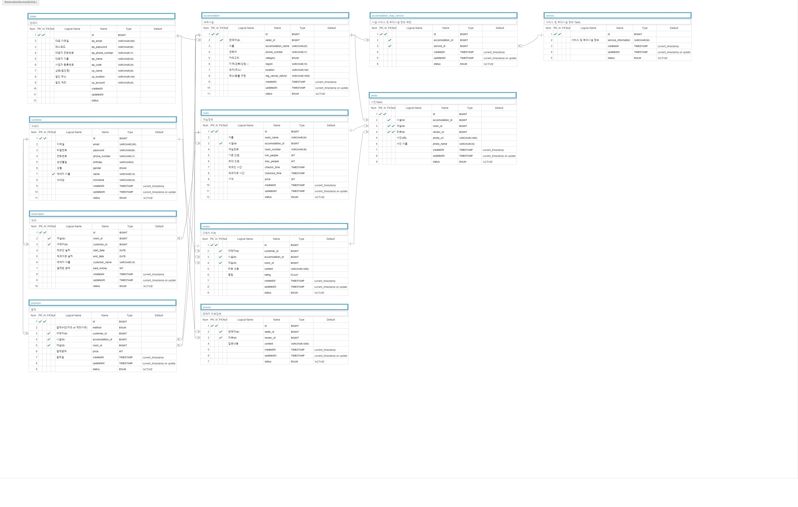

# 주제 : 숙박 예약 서비스
## 프로젝트 설명
숙박 시설을 예약하는데 집중된 프로젝트이며, 유저의 시설 검색에서부터 예약 및 결제까지의 비즈니스 로직을 구현해보기 위한 프로젝트입니다.
## 기능 정의
### 1. 회원
- 회원가입 / 로그인 방식
  - 이메일, 비밀번호 입력 방식
- 회원가입
  - 이메일, 비밀번호
  - 전화번호 → 전화번호 인증
  - 생년월일, 성별, 닉네임 입력
- 회원정보 수정
  - 닉네임 수정
- 회원 구분
  - JWT
### 2. 판매자
- 시설정보 관리
  - 시설정보 등록
    - 시설 카테고리 (모텔,호텔,리조트,펜션,풀빌라,캠핑,글램핑)
    - 시설 이름
  - 연락처
  - 시설 내 객실 상세정보
    - 객실 이름
    - 객실 사진 (최대 10장)
    - 기준인원 / 최대인원
    - 체크인 / 체크아웃 시간
    - 가격
  - 사진 등록 (최대 갯수 : 20장 제한)
  - 서비스 및 부대시설 등록
  - 취소 및 환불 규정
  - 위치 등록
- 시설정보 수정
- 시설정보 삭제
- 리뷰 관리
  - 고객 리뷰 대댓글 달기
  - 허위사실 리뷰 신고
### 3. 구매자
- 가능 시설 조회하기
  - 지역 / 날짜 / 인원 선택
    1. 해당 날짜에 예약이 없는 시설 위주로 조회되게 함
    2. 최대 인원 옵션 내로 조회되도록 함
    3. 선택한 지역 위주로 조회되도록 함
  - 시설 검색 (지역 & 시설명)
    - Elastic Search 사용
    - 처음 개발할 때는 지역 카테고리만 선택하여 조회
- 예약하기
  - 객실 선택, 예약자 이름, 전화번호 입력 후 예약
  - 결제가 필요할 듯 → 테스트 결제 → 포트원
  - 카드 & 실시간 계좌이체 & 무통장입금
  - 구매자 전화번호는 구매자 정보에서 가져옴
- 리뷰쓰기
  - 평점 달기
  - 사진 등록 (최대 10장)
  - 글쓰기
## 주요 개발로직 우선순위
### 1순위 : Elastic Search
### 2순위 : 결제 API
### 3순위 : 전화번호 인증
### 이외 고려사항
1. 캐싱 고려 → 동시성 이슈
2. Oauth 2.0 적용(Kakao/Naver/Google)
3. 예약 내역 ( History ) 조회 기능
4. 쿠폰 및 포인트 기능 관련 기획&개발
## ERD

ERD URL : https://aquerytool.com/aquerymain/index/?rurl=409e7d0a-ca34-451f-9a0b-9926500455d1
 
Read-Only PW : 374y3b
## Tech

