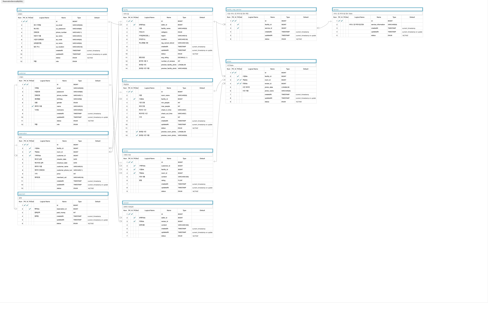

# 숙박 예약 서비스
숙박 시설을 예약하는데 집중된 프로젝트이며, 유저의 시설 검색에서부터 예약 및 결제까지의 비즈니스 로직을 구현해보기 위한 프로젝트입니다.
## 사용 기술
### Language & Framework

### DataBase

### DevOps

### WebHook

## 기능
### 회원
- 회원가입
  - 판매자
    - 회사 이메일, 비밀번호, 회사 전화번호, 대표자 이름, 사업자 번호, 법인명(회사명), 법인주소 입력
  - 구매자
    - 개인 이메일, 비밀번호, 개인 전화번호, 생년월일, 성별, 닉네임
- 로그인 방식
  - 이메일, 비밀번호 입력 방식
- 회원정보 수정
  - 닉네임, 기본 예약자 이름 설정
- 회원 구분
  - JWT(`Access Token`, `Refresh Token`)

### 시설

#### 판매자
- 시설정보 관리
  - 시설정보 CRUD
    - 시설 카테고리 (모텔,호텔&리조트,펜션&풀빌라,캠핑&글램핑)
    - 시설 이름
    - 시설 내 객실 상세정보
      - 객실 이름
      - 기준인원 / 최대인원
      - 체크인 / 체크아웃 시간
      - 가격
    - 사진 등록 및 수정 (최대 10장)
    - 서비스 및 부대시설 등록
    - 취소 및 환불 규정
    - 위치 등록
  - 시설정보 삭제
- 객실 사진 등록 및 수정
  - 객실 사진 (최대 10장)
- 객실 CRUD
  - 객실 CUD 기능에는 `Elastic Search 동기화`가 진행된다
- 리뷰 관리
  - 고객 리뷰 `대댓글` 달기
#### 구매자
- 시설 검색
  - 시설 검색
    - 검색 키워드는 `시설명` & `지역명(강원,경북 등)` & `주소` 가능
    - 시설을 검색할 때 표시되는 `가격`은 해당 시설이 포함하고, 예약 가능한 객실들 중에서 `최소가격`을 표시되도록 해야함
- 예약하기
  - `객실 선택` > `예약자 이름`, `전화번호` 입력 후 예약
  - 예약을 하면 `예약 선점 상태` - `PAYMENT_WAIT`
- 결제
  - PortOne & KG이니시스 결제사 이용.
  - 결제를 완료하면 `결제 완료 상태` - `PAYMENT_FINISH`
  - `PAYMENT_WAIT`,`PAYMENT_WAIT`인 객실은 검색에서 제외된다
    - 제외가 된다는 말은, 시설 검색에 나오는 가격을 결정할 때 비교군에서 제외가 된다는 의미이다
- 리뷰쓰기
  - 실제로 `예약내역이 있는 사람`에게만 `단 한번의 리뷰쓰기` 기회를 부여함
  - 평점 달기
  - 사진 등록 (최대 10장)
  - 글쓰기

## ERD

---

ERD URL : https://aquerytool.com/aquerymain/index/?rurl=409e7d0a-ca34-451f-9a0b-9926500455d1
 
Read-Only PW : 374y3b

